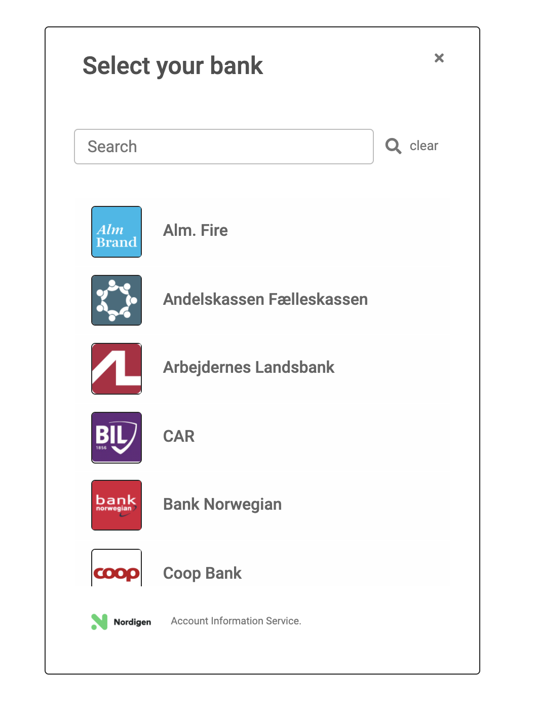
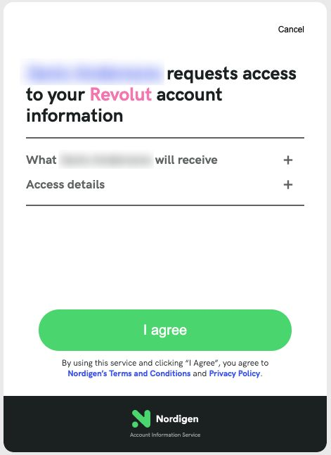
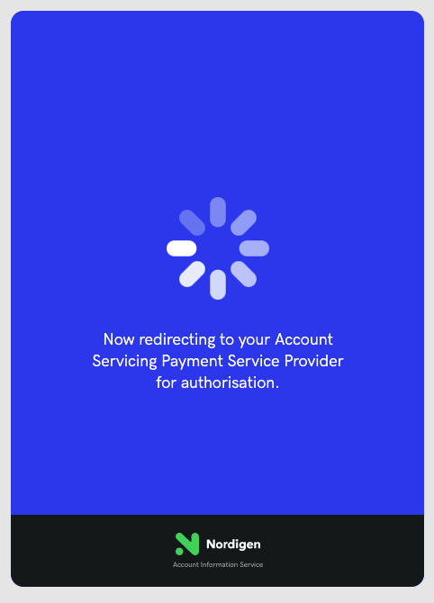
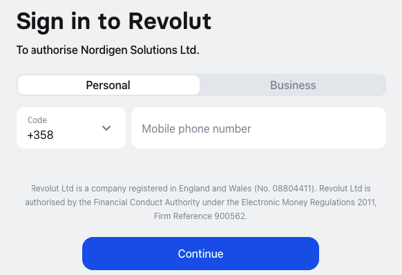
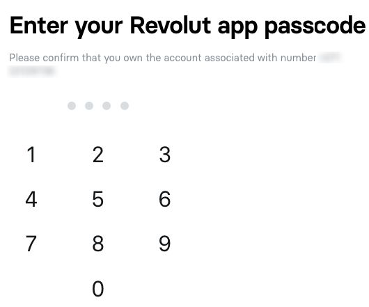
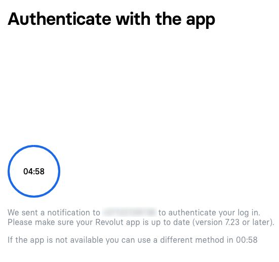
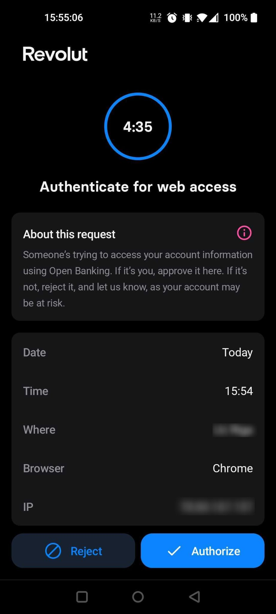
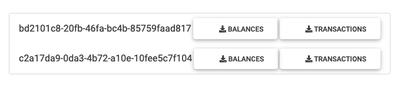

# Flask example
### Install & run

```bash
pip3 install -r requirements.txt;
python3 app.py
```

\
You'll need to get your token from the [Nordigen's Open Banking Portal](https://ob.nordigen.com/login/)


##### 1. Go to http://localhost:8081/
<!--  -->
<p align="center">
    
</p>
Enter access token and press enter


##### 2. Select Country
<!--  -->
<p align="center">
    
</p>

##### 3. Select bank
<!--  -->
<p align="center">
    
</p>

##### 4.1. Nordigen agreement
<p align="center">
  
   
</p>

##### 5. Sign into ASPSP
<p align="center">
  
   
   
</p>

<p align="center">
   
</p>

##### 6. Select accounts
<p align="center">
  
</p>

##### 7. Download data
Here redirect from nordigen to http://localhost:8081/results?ref={ref_id} happens
<p align="center">
  
</p>
